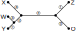
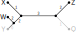

---------------------------------

# Exercise 1 - Quartet Tree Basics

### 1a)

How many possible quartet trees can you produce with six taxa of any specific topology?


#### {.tabset }

##### Hide


##### Formula

::::{#img1-p .extra-m}
::: {#img3 .tutorial-img}
```{r, echo=FALSE, out.width="20%", fig.align='center', include=knitr::is_html_output()}
knitr::include_graphics("figures/sheet-12/sheet12-exercise1-a-formula.svg")
```
:::
::::

##### Solution

::::{#img1-p .extra-m}
::: {#img3 .tutorial-img}
```{r, echo=FALSE, out.width="80%", fig.align='center', include=knitr::is_html_output()}
knitr::include_graphics("figures/sheet-12/sheet12-exercise1-a-solution.svg")
```
:::
::::


#### {-}


### 1b)

What does a set of quartet trees tell you, in a biological sense?


#### {.tabset }

##### Hide


##### Formula

- [ ]  It tells you which of the quartet trees are likelier than others.

- [ ]  It tells you which of the taxa are closer related than others.

- [ ]  It tells you the exact distance between each set of four taxa.


##### Solution

- [ ]  It tells you which of the quartet trees are likelier than others.

- [x]  It tells you which of the taxa are closer related than others.

- [ ]  It tells you the exact distance between each set of four taxa.

#### {-}

# Exercise 2 - Quartet Tree Reconstruction

You are given a set of quartet trees and an initial topology. You want to include a new taxa P. Where does the P belong to? (We are only using five quartet trees, but there are more possible as you determined in exercise 1 a.)

Quartet Trees:

$N_1(P,Y|Q,W)$ \
$N_2(X,P|Z,W)$ \
$N_3(X,Z|P,W)$ \
$N_4(P,Y|Z,Q)$ \
$N_5(X,Z|Q,P)$ \

Initial Topology:

::::{#img1-p .extra-m}
::: {#img3 .tutorial-img}
```{r, echo=FALSE, out.width="80%", fig.align='center', include=knitr::is_html_output()}

```
:::
::::


The letters a-g denote the edges in the topology and represent the **violation counter.**

### 2a) 

Add **$N_1(P,Y|Q,W)$** to the initial topology. How does the violation counter look after adding $N_1$?

#### {.tabset }

##### Hide


##### Solution

::::{#img1-p .extra-m}
::: {#img3 .tutorial-img}
```{r, echo=FALSE, out.width="80%", fig.align='center', include=knitr::is_html_output()}
knitr::include_graphics("figures/sheet-12/sheet12-exercise2-a-solution.svg")
```
:::
::::
#### {-}


### 2b) 

Add **$N_2(X,P|Z,W)$** to the initial topology. How does the violation counter look after adding $N_2$?

#### {.tabset }

##### Hide


##### Solution

::::{#img1-p .extra-m}
::: {#img3 .tutorial-img}
```{r, echo=FALSE, out.width="80%", fig.align='center', include=knitr::is_html_output()}
knitr::include_graphics("figures/sheet-12/sheet12-exercise2-b-solution.svg")
```
:::
::::
#### {-}


### 2c) 

Add **$N_3(X,Z|P,W)$** to the initial topology. How does the violation counter look after adding $N_3$?

#### {.tabset }

##### Hide


##### Solution

::::{#img1-p .extra-m}
::: {#img3 .tutorial-img}
```{r, echo=FALSE, out.width="80%", fig.align='center', include=knitr::is_html_output()}

```
:::
::::
#### {-}


### 2d) 

Add **$N_4(P,Y|Z,Q)$** to the initial topology. How does the violation counter look after adding $N_4$?

#### {.tabset }

##### Hide


##### Solution

::::{#img1-p .extra-m}
::: {#img3 .tutorial-img}
```{r, echo=FALSE, out.width="80%", fig.align='center', include=knitr::is_html_output()}
knitr::include_graphics("figures/sheet-12/sheet12-exercise2-d-solution.svg")
```
:::
::::
#### {-}


### 2e) 

Add **$N_5(X,Z|Q,P)$** to the initial topology. How does the violation counter look after adding $N_5$?

#### {.tabset }

##### Hide


##### Solution

::::{#img1-p .extra-m}
::: {#img3 .tutorial-img}
```{r, echo=FALSE, out.width="80%", fig.align='center', include=knitr::is_html_output()}
knitr::include_graphics("figures/sheet-12/sheet12-exercise2-e-solution.svg")
```
:::
::::
#### {-}


### 2f) 

To which edge will taxon $P$ be attributed, after adding quartet trees $N_1$ to $N_5$. What is the closest taxon to the newly added taxon $P$?

#### {.tabset }

##### Hide


##### Solution

Edge - "C" \
Taxon - "Y"


#### {-}
