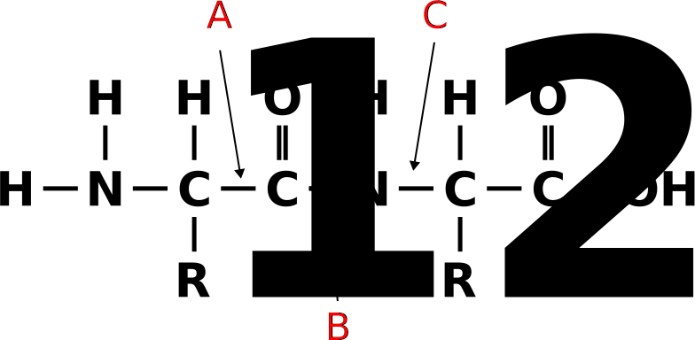

---------------------------------

# Exercise 1 - The genetic code

The standard genetic code  describes how 64 possible codons encode 20 amino
acids and the stop translation signal. It enables DNA-encoded mRNA to be translated into amino acid sequences
and is common to all living organisms on Earth.


::::{#img1-p .extra-m}
::: {#img3 .tutorial-img}
```{r, echo=FALSE, out.width="70%", fig.align='center', include=knitr::is_html_output()}
knitr::include_graphics("figures/sheet-6/Aminoacids_table.svg")
```
:::
::::

:::: {#explaining .message-box }

::: {#note-exp .note-header}
```{r, include=knitr::is_html_output(), echo=FALSE,}
knitr::include_graphics("figures/infoicon.svg")
```
**Note**
:::
::: {#note-exp .note-body}

Above you can see the RNA codon table (or "Code-Sonne"). It can be used to translate a sequence of
nucleotide triplets into a sequence of amino acids. The tabe is read from the inside to the outside.
e.g. the triplet `AUG` would translate to Methionine (the start codon).

:::
::::


#### {.tabset}

##### Question 1A

::: {.question data-latex=""}

Which aminoacid is encoded by the codon **UAC**?

::: 

##### Hint : Possible Answers

- [ ] Histidine
- [ ] Proline
- [ ] Tyrosine


##### Correct Answer

- [ ] Histidine
- [ ] Proline
- [x] Tyrosine

#### {-}

#### {.tabset}

##### Question 1B

::: {.question data-latex=""}

How many codons encode the aminoacid Valine?
::: 

##### Hint : Possible Answers

- [ ] 4
- [ ] 2
- [ ] 3


##### Correct Answer

::: {.answer data-latex=""}

- [x] 4
- [ ] 2
- [ ] 3


::: 

#### {-}


#### {.tabset}

##### Question 1C

Which aminoacid sequence encodes the following codons?

```
AUG-UGC-CUU-ACU-AAA-AGU-CGU-CAU-GAC-GAG-CUG-UAC-GGG-UGA
```


##### Hint : Possible Answers

- [ ] Met-Cys-Leu-Trp-Lys-Ser-Arg-His-Asp-Glu-Leu-Tyr-Gly
- [ ] Met-Trp-Leu-Thr-Lys-Ser-Arg-His-Asp-Glu-Leu-Tyr-Gly
- [ ] Met-Cys-Leu-Thr-Lys-Ser-Arg-His-Asp-Glu-Leu-Tyr-Gly


##### Correct Answer


- [ ] Met-Cys-Leu-Trp-Lys-Ser-Arg-His-Asp-Glu-Leu-Tyr-Gly
- [ ] Met-Trp-Leu-Thr-Lys-Ser-Arg-His-Asp-Glu-Leu-Tyr-Gly
- [x] Met-Cys-Leu-Thr-Lys-Ser-Arg-His-Asp-Glu-Leu-Tyr-Gly


#### {-}


# Exercise 2 - Protein structures


#### {.tabset} 


##### Question 2A

Name the parts corresponding to the figure below

::::{#img1-p .extra-m}
::: {#img3 .tutorial-img}
```{r, echo=FALSE, out.width="50%", fig.align='center', include=knitr::is_html_output()}
knitr::include_graphics("figures/sheet-6/sheet6-exercise1-aminoacid.svg")
```
:::
::::

##### Hint

The Names are:

 alpha carbon amino group, carboxyl group and side chain.


##### Correct Answer


A.  amino group
B.  side chain
C.  alpha carbon
D.  carboxyl group


#### {-}

#### {.tabset} 


##### Question 2B

Select the peptide bound in the following dipeptide.

::::{#img1-p .extra-m}
::: {#img3 .tutorial-img}
```{r, echo=FALSE, out.width="50%", fig.align='center', include=knitr::is_html_output()}

```
:::
::::

##### Hint

A peptide bond is an amide type of covalent chemical bond linking two consecutive 
alpha-amino acids via the carbon atom nr. 1 of the first  and the nitrogen atom nr 2 of the second amino acid.

##### Correct Answer

**B**

#### {-}

#### {.tabset} 


##### Question 2C

The 3D structure of a protein is very important for its function.
Name the structure types in the figure below. 

::::{#img1-p .extra-m}
::: {#img3 .tutorial-img}
```{r, echo=FALSE, out.width="100%", fig.align='center', include=knitr::is_html_output()}
knitr::include_graphics("figures/sheet-6/sheet6-exercise1-structures.svg")
```
:::
::::

##### Hint

Match the names

- primary structure
- secondary structure 
- tertiary structure
- quaternary structrue
- alpha-helix
- beta-sheet. Note that can be multiple correct options.


##### Correct Answer

A.  primary structure
B.  secondary structure, beta sheet
C.  secondary structure, alpha helix
D.  tertiary structure
E.  quaternary structure


#### {-}


# Exercise 3 - What are enzymes?

Enzymes are important molecules because they can substantially speed up chemical 
reactions and enhance their specificity. They are sometimes referred to as 
biocatalysts. Catalysts are compounds that influence chemical reactions 
being used up as a result. In other words, they are reusable. A single enzyme 
molecule processes about 100.000 to 5 million molecules every minute.

Shortly explain the function of the further mentioned enzymes regarding their role in 
prokaryotic translation or transcription

#### {.tabset} 


##### Question 3A

DNA Polymerase III

##### Correct Answer

DNA Polymerase III is responsible for bacterial chromosomal DNA replication, along with the helicase and primase, at the replication fork. 

#### {-}

#### {.tabset} 

##### Question 3B

DNA Ligase

##### Correct Answer

The DNA Ligase catalyze the formation of a phosphodiester bond between the
5'-P group of one single DNA strand with the adjacent 3'-OH group of another chain.

#### {-}

#### {.tabset} 

##### Question 3C

RNA Polymerase

##### Correct Answer

RNA Polymerases are enzymes responsible for copying a DNA sequence into an 
RNA sequence, during the process of transcription.

#### {-}

#### {.tabset} 

##### Question 3D

RNAse H

##### Correct Answer

Ribonucleases H are enzymes that cleave the RNA of RNA/DNA hybrids that 
form during replication and repair and which could lead to DNA instability if they were not processed.

#### {-}

#### {.tabset} 

##### Question 3E

DNA Helicase

##### Correct Answer

DNA Helicases are enzymes that are able to unwind DNA by the use of the 
energy-equivalent ATP. They play essential roles in DNA replication, DNA repair, and DNA recombination in all organisms.

#### {-}

#### {.tabset} 

##### Question 3F

DNA Primase

##### Correct Answer

DNA primase catalyses the synthesis of short RNA molecules used as primers for the DNA polymerase during DNA replication

#### {-}

# Exercise 4 - The RCSB Protein Database - PDB

Protein structures are hard to resolve. Therefore, identified protein structures 
are stored in according databases to enable a fast access and to gather all 
data associated. An example is the RCSB Protein Data Base (PDB).

::::{#img1-p .extra-m}
::: {#img3 .tutorial-img}
```{r, echo=FALSE, out.width="100%", fig.align='center', include=knitr::is_html_output()}
knitr::include_graphics("figures/sheet-6/sheet6-exercise7-protein.gif")
```

*Lapinaite, A., Knott, G. J., Palumbo, C. M., Lin-Shiao, E., Richter, M. F., Zhao, K. T., ... & Doudna, J. A. (2020). DNA capture by a CRISPR-Cas9–guided adenine base editor. Science, 369(6503), 566-571.*
:::
::::

Access the protein information of the above shown protein SpCas9 with PDB-ID ABE8e and answer the following questions:

https://www.rcsb.org/

#### {.tabset} 

##### Question 4A

From which organism is this protein?

##### Correct Answer

*Streptococcus pyogenes* and *Escherichia coli*

:::: {#explaining .message-box }

::: {#note-exp .note-header}
```{r, include=knitr::is_html_output(), echo=FALSE,}
knitr::include_graphics("figures/infoicon.svg")
```
**Note**
:::
::: {#note-exp .note-body}

This is an artificially designed Protein containing the CRISPR-associated endonuclease Cas9
from *Streptococcus pyogenes* and the t-RNA adenine deaminase A v8e (TadA-8e) from 
*Escherichia coli*.

:::
::::

#### {-}


#### {.tabset} 

##### Question 4B

How many amino acids does this protein consist of?

##### Correct Answer

1361

#### {-}


