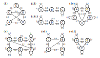

---------------------------------

# Exercise 1 - Up-to-date or Behind

Alex is taking a bioinformatics class and in each week he can be either up-to-date or he may have fallen behind. If he is up-to-date in a given week, the probability that he will be up-to-date in the next week is 0.75. If he is behind in the given week, the probability that he will be up-to-date in the next week is 0.5.

If we assume that these probabilities do not depend on whether he was up-to-date or behind in previous weeks, we can model the problem using a Markov chain.


### 1a)

Draw a Markov chain that models the states of being Up-to-date or behind


#### {.tabset }

##### Hide


##### Solution

::::{#img1-p .extra-m}
::: {#img3 .tutorial-img}
```{r, echo=FALSE, out.width="100%", fig.align='center', include=knitr::is_html_output()}

```
:::
::::

#### {-}

### 1b)

Assume Alex is up-to-date in the first class; what is the probability that he is up-to-date two classes later? 

#### {.tabset}

##### Hide


##### Hint : Formulae

\begin{align}
  \pi(0) &: initial\ probabilities\\
  P&: transition\ matrix\\
  \pi(t) &= \pi(0) * P^{t}
\end{align}
  
  

##### Solution

The Probability is 0.6875

\begin{align}
  \pi(0) &= 
  \begin{pmatrix}
    1 & 0
  \end{pmatrix}\\
  \\
  P &= 
  \begin{pmatrix}
    0.75 & 0.25\\
    0.5 & 0.5
  \end{pmatrix}\\
  \\
  \pi(2) &= \pi(0) \times P^{2}\\
  &=
  \begin{pmatrix}
    0.6875 & 0.3125
  \end{pmatrix}
\end{align}

#### {-}

### 1c)

What is the expected probability that he is behind after an infinitely long semester?

#### {.tabset}

##### Hide

##### Hint : Formulae


\begin{align}
  \pi(0) &: initial\ probabilities\\
  P&: transition\ matrix\\
  \lim \limits_{x \to \infty} \pi(t) &= \pi(0) * P^{t}
\end{align}


##### Solution

The Probability is 2/3


$$
\lim \limits_{t \to \infty} \pi(t) = \pi(0) * P^{t} = 
  \begin{pmatrix}
    2/3 & 1/3
  \end{pmatrix}
$$

#### {-}


### 1d)

 What is the transition probability matrix product for limit of $P^{t}$ as $t$ approaches infinity?
 
#### {.tabset}


##### Hide


##### Solution


\begin{align}
  \lim \limits_{t \to \infty} P^t &= 
  \begin{pmatrix}
    2/3 & 1/3 \\
    2/3 & 1/3
  \end{pmatrix}
\end{align}

#### {-}


# Exercise 2 - Stationary distribution

Consider a three-state Markov chain having the following transition probability matrix:

$$
\begin{pmatrix}
  0.5 & 0.4 & 0.1\\
  0.3 & 0.4 & 0.3\\
  0.2 & 0.3 & 0.5
\end{pmatrix}
$$

### 2a)

In the long run, what proportion of time is the process in each of the three states?

#### {.tabset} 


##### Hide

##### Hint: Formulae

See Question 1B


##### Correct Answer


 
\begin{align}
  \lim \limits_{x \to \infty} P^t &= 
  \begin{pmatrix}
    0.339 & 0.371 & 0.290\\
    0.339 & 0.371 & 0.290\\
    0.339 & 0.371 & 0.290
  \end{pmatrix}\\
  \\
  \lim \limits_{t \to \infty} \pi(t) &= \
  \begin{pmatrix}
    0.339 & 0.371 & 0.290
  \end{pmatrix}
\end{align}

:::: {#explaining .message-box }

::: {#note-exp .note-header}
```{r, include=knitr::is_html_output(), echo=FALSE,}
knitr::include_graphics("figures/infoicon.svg")
```
**Note**
:::
::: {#note-exp .note-body}

$$
  \lim \limits_{t \to \infty} \pi(t)
$$

 is independent of $\pi(0)$ as long as $P$ does not contain disconnected subgraphs and only if the limit exists.

:::
::::


#### {-}

#### {.tabset} 


# Exercise 3 - Reversibility


Consider a three-state Markov chain having the following transition probability matrix

$$
\begin{pmatrix}
  0 & 1 & 0 \\
  \dfrac{1}{3} & 0 & \dfrac{2}{3}\\
  0 & 1 & 0
\end{pmatrix}
$$

### 3a)

Draw the Markov chain for this problem

#### {.tabset} 

##### Hide


##### Solution


::::{#img1-p .extra-m}
::: {#img3 .tutorial-img}
```{r, echo=FALSE, out.width="60%", fig.align='center', include=knitr::is_html_output()}

```
:::
::::

#### {-}

### 3b)

Given the stationary distribution $\begin{pmatrix} \dfrac{1}{6} & \dfrac{1}{2} & \dfrac{1}{3} \end{pmatrix}$,
is this Markov chain reversible and what does this property tell you?

#### {.tabset} 

##### Hide

##### Hint

A markov chain is reversible if:

$$
\pi_i^{*}P_{i,j} = \pi_j^{*}P_{j,i}
$$

Easiest way is to calculate it for all pairs of $i$ and $j$


##### Solution

Because $\pi_i^{*}P_{i,j} = \pi_j^{*}P_{j,i}\ \forall\ i,j$ the Markov chain is reversible


\begin{align}
  \pi^{ * }_1 P_{1,2} &=& \dfrac{1}{6} \times 1 &=& \dfrac{1}{6} &=& \dfrac{1}{2} \times \dfrac{1}{3} &=& \pi^{ * }_2 P_{2,1}\\
  \pi^{ * }_1 P_{1,3} &=& \dfrac{1}{6} \times 0 &=& 0 &=& \dfrac{1}{3} \times 0 &=& \pi^{ * }_3 P_{3,1}\\
  \pi^{ * }_2 P_{2,3} &=& \dfrac{1}{2} \times \dfrac{2}{3}  &=& \dfrac{1}{3} &=& \dfrac{1}{3} \times 1 &=& \pi^{ * }_3 P_{3,2}
\end{align}

#### {-}


# Exercise 4 - Markov chain representation

### 4a)

Decide which of the following figures represents a valid Markov Chain

::::{#img1-p .extra-m}
::: {#img3 .tutorial-img}
```{r, echo=FALSE, out.width="100%", fig.align='center', include=knitr::is_html_output()}

```
:::
::::


#### {.tabset} 


##### Hide

##### Solution


+ [x] i
+ [ ] ii - initial probabilities add up to 0.2
+ [ ] iii - transition probabilities for states A and B do not add up to 1
+ [ ] iv - duplicate state A
+ [ ] v - initial probabilities add up to 1.1
+ [x] vi
+ [ ] vii missing transition probabilites (0.1) for state C


#### {-}

### 4b)

Which of these statements about Markov Chains are valid?

#### {.tabset} 

##### Statements

- [ ] In the graph representation of Markov chains, a single state cannot have more than 3 outgoing edges.
- [ ] In the matrix representation of Markov chains, values in each row have to add up to 1.
- [ ] In the matrix representation of Markov chains, values in each column have to add up to 1.
- [ ] The diagonal entries of the Markov chain matrix represent the transition probability of remaining in the current state.
- [ ] In the graph representation of Markov chains, a single state cannot have more than 3 ingoing edges.
- [ ] The graph representation of Markov chains is directed and acyclic by definition.
 
 
##### Solution

- [ ] In the graph representation of Markov chains, a single state cannot have more than 3 outgoing edges.
- [x] In the matrix representation of Markov chains, values in each row have to add up to 1.
- [ ] In the matrix representation of Markov chains, values in each column have to add up to 1.
- [x] The diagonal entries of the Markov chain matrix represent the transition probability of remaining in the current state.
- [ ] In the graph representation of Markov chains, a single state cannot have more than 3 ingoing edges.
- [ ] The graph representation of Markov chains is directed and acyclic by definition.


